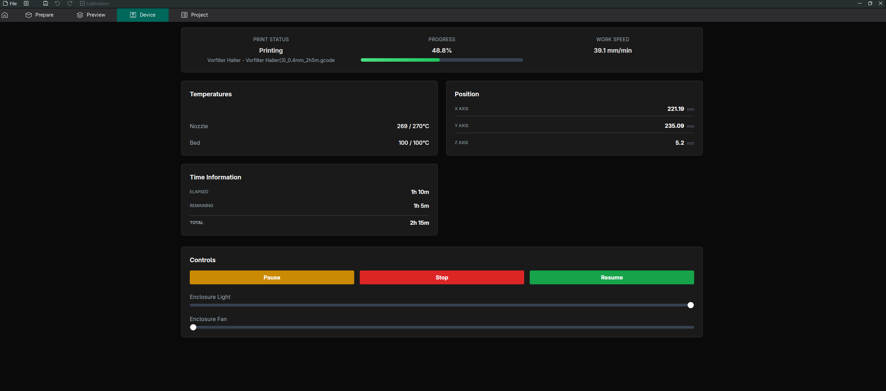
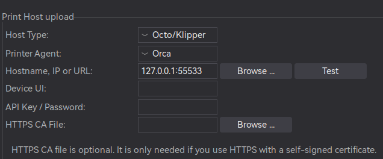

# Snapmaker Proxy

A quick and dirty proxy for the Snapmaker 2.0 that allows you to start prints directly from slicers like OrcaSlicer.
This is really nothing more than a small webserver imitating part of the [OctoPrint API](https://docs.octoprint.org/en/main/api/files.html#upload-file-or-create-folder) and forwarding calls to the Snapmaker.

## Screenshot



## Configuration

Edit the configuration in `src/config.rs`:

```rust
// Snapmaker printer endpoint (change to your printer's IP)
pub(crate) const SNAPMAKER_ENDPOINT: &str = "http://192.168.0.138:8080";

// Token file path (automatically created by the proxy on first use)
pub(crate) const TOKEN_FILE: &str = "snapmaker_token.txt";

// Proxy server address
pub(crate) const SERVE_ADDRESS: &str = "127.0.0.1:55533";
```

## Prerequisites

- Rust toolchain (install via [rustup](https://rustup.rs/))
- Cargo (comes with Rust toolchain)
- A Snapmaker 2.0 on your local network

## Installation

1. Clone this repository
2. Configure the Snapmaker's IP address in `src/config.rs`

## Running the Proxy

Start the proxy server using Cargo:

```bash
cargo run
```

The proxy will:
1. Start on `127.0.0.1:55533` by default
2. Automatically obtain and store a Snapmaker authentication token (first time requires authorization on touchscreen)
3. Maintain a keep-alive connection to the printer and display basic status (position, progress, temperature).

## Orca Slicer Configuration



## Web Interface

Access the web interface at `http://127.0.0.1:55533/` or in OrcaSlicer's "Device" tab to:

- Monitor print status
- Control printer functions (pause, stop, resume)
- Control enclosure (lights, fan)

## Known Issues

- **G-code Persistence**: Files started via this proxy are not persistently saved to the Snapmaker's internal storage. The print will continue normally, but you won't be able to restart it from the Snapmaker's interface after completion, however **it is safe** to disconnect the proxy during printing. The print job will continue on the Snapmaker without interruption.

## Troubleshooting

- Ensure your Snapmaker printer is powered on and connected to the same network
- Verify the IP address in `config.rs` matches your printer's actual IP

